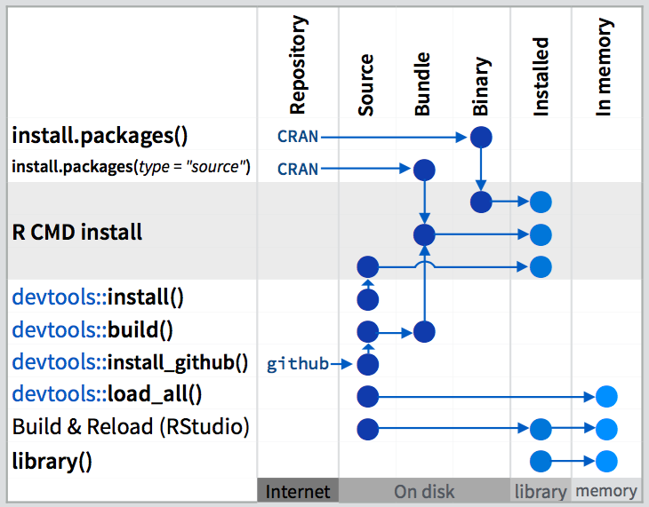
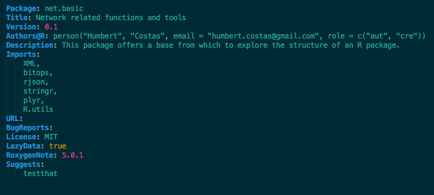
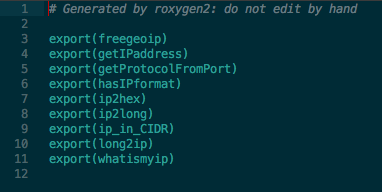

```{r setup, include=FALSE}
knitr::opts_chunk$set(echo = FALSE)
knitr::opts_chunk$set(fig.align = 'center')
```

## About the laboratory

This second laboratory assumes that the first laboratory has been entirely completed. Thus, most of the work will be done using the tools seen in the first one.

In case the first is not completed, it is encouraged for you to first complete the previous one, ask any doubts that may arise, and then, complete this one.

### Submit laboratory

In order to complete this laboratory, it will be necessary to fill the `answers_lab2.Rmd` R Markdown file with the answers to the different statements included in this file.


# R Packages

## Devtools as a package to create packages

When creating a new package, the *Devtools* package is probably the most widely tool used to complete such task. 
It offers a comprehensive set of functionalities that simplify the process, from the very beginning to every subsequent iteration of the development cycle.

Making use of it, it is really easy to create a base to build the package with a correct directories structure, hence eliminating the initial difficulty to have something where to start.

```{r, out.width = "500px"}

```

In addition to the initial base, the package also excels providing a set of funcitons that speed up the iterative process
to test changes when developing our code.


Summing up, devtools package provides tools to ease:

- Install packages from outside CRAN
- Facilitate the release of new package versions
- Easy management through development phases


Moreover, it is also noticeable the set of functions included in Devtools that that facilitate the utilization of external services related to development good practices such as continuous integration or test frameworks. 

- _Install devtools, the package developing tools, either by using the console or the Packages pane._


## Basic structure of a package

### DESCRIPTION file

The description file, is a regular plain text file that contains the details regarding the package. information such as the real _package name_, _authors_ or the _license_  are defined completing respective fields.

```{r, out.width = "500px"}

```

### NAMESPACE file

The other regular plain text that must be necessarily in the root of the package. The content of the file defines which functions will be exported. That is, the functions that will be available to the final user who after installing the package.

```{r, out.width = "400px"}

```

Although this is indeed a simple file, it is usually automatically generated according to the functions documentation when calling `devtools::document()`, a wrapper function for `roxygenize()`.

### R folder

The R folder represents the main directory for a R package. All the code included in our package must be contained within it. 

Apart from this rule, code can be freely organized within the R folder. Nevertheless, it is a good practice to keep related code within the same file, thus creating as many R.files as necessary.

### Other optional folders/files

Beside the previous files and R folder previousy introduced, which represent the minimum structure for an R package, in order to make use of more advanced tools, other files can be included in package root. 

Some of these are:

- **README.md**

This file with _markdown_ extension, albeit not strictly necessary, is usually included. The reason behind that is that by default, most repository providers (Github, Bitbucket, etc) show the content of this file in the root of the repository.

So it is a great opportunity to include in it some considerations such as the package name, a brief description, a short _how-to_ or any relevant detail regarding the package.

- **data/**:

All files included in this directory will be available to the user after installing the package. A very common use of this folder, usually involves R data frames containing data related to the package itself.

Since user will be able to make use of the R data frames or the data contained in this folder, ideally all the infomartion included should be documented.

- **tests/**:

Testing package functions is the key to ensure the correctness of our code. Although these can be wrongly seen as an unaffordable overhead to the development process, truth is that testing proves as indispensable in order to refactor code, and in the end pays off.

```{r testhat, eval=FALSE}
# create test environment for the package
use_testthat(pkg = ".")

# create base_test file where to actually code tests.
use_test("base_test", pkg = ".")
```

Many test frameworks exist in R, but _testhat_ is perhaps one of the easiest to use. In this task, devtools includes functions to prepare the testing environment.

- **.travis.yml**:
 Travis is an external continuous integration service that can be freely used for open source projects. It can handle the execution of tests in a custom environment. 

Supporting numerous programming languages a part from R, it is specially useful to test the code correctness.


Once again, devtools provides a function to create the skeleton of this file to make things easier.

```{r travis_file, eval=FALSE}
devtools::use_travis()
```

Moreover, it has been seamless integrated within GitHub so that when pushing new commits to the remote repository, these are automatically tested. To make use of travis, is only necessary to allow Travis access to the remote repository and include this _yaml_ file in the root of the package. 

---

# Inspecting XML source schema

Before actually starting to code the whole CPE parser, it is much more effective to start by studying the schema of the XML file in this matter. This file is usually available, and certainly, there is one for each security standard, including CPE, CVE, CWE, etc.

- _Download the CPE XML schema from the [NVD website.](https://nvd.nist.gov/cpe.cfm)_

- _Study the schema file for the XML hierarchy. (Use any code editor to open the file, a good highlighting can be very useful)_

- _Try to elaborate possible XPATH queries that could extract relevant information._

&nbsp;

You should at least be capable to derive the following information from the schema:

> _The cpe-list element acts as a top-level container for CPE Name items. [...]_

- The `cpe-list` tag is a CPE entry container.

From the following excerpt:

> _The ItemType complex type defines an element that represents a single CPE Name._

- Each CPE entry is comprised within a `cpe-item` tag which is of the `ItemType` type.

The cpe-item type definition 

> _The required name attribute is a URI which must be a unique key and should follow the URI structure outlined in the CPE Specification. [...]_

- The `cpe-item` tag has a mandatory `name` attribute, that contains the CPE id.

As specifically stated in the CPE XML schema in the `cpe-item` tag section:

> _The required name attribute is a URI which must be a unique key and should follow the URI structure outlined in the CPE Specification. [...]_

From the following XML schema chunk:

```{xml}
<xsd:sequence>
  <xsd:element name="title" type="cpe_dict:TextType" minOccurs="0" maxOccurs="unbounded"/>
  <xsd:element name="notes" type="cpe_dict:NotesType" minOccurs="0" maxOccurs="unbounded"/>
  <xsd:element name="references" type="cpe_dict:ReferencesType" minOccurs="0" maxOccurs="1"/>
  <xsd:element name="check" type="cpe_dict:CheckType" minOccurs="0" maxOccurs="unbounded"/>
  <xsd:any minOccurs="0" maxOccurs="unbounded" namespace="##other" processContents="lax"/>
</xsd:sequence>
```
- Each `cpe-item` tag can have additional inner tags such as `title`, `notes`, `reference`.


## Parsing XML

Once we have reviewed the schema of the XML, it is time for some coding. It is specially important to restrict the scope of each one of the functions, avoiding complex functions that do too many things.

- _Download the CPE dictionary file from the [NVD website.](https://nvd.nist.gov/cpe.cfm)_

Although for this first small package, code architecture might not be specially decisive, bear in mind that large projects require from a well-though design in order to succeed.

Regarding this particular package one approach could be based on the following functions among others:

```{r, echo=TRUE,eval=FALSE}
#' Get data frame from CVE entry
#' 
#' This function returns a single data frame
#' of one row containing th details from the 
#' CPE passed as parameter.
#' @param cpe.raw
#'
#' @return data.frame
GetCPEItem <- function(cpe.raw) {
  cpe <- NewCPEItem()
  cpe.raw <- XML::xmlToList(cpe.raw)

  # transform the list to data frame
  
  # return data frame
}


#' Get CPE data frame
#'
#' The main function to parse CPE XML file. Expects one 
#' parameter representing the file to be parserd.
#' Internally, makes use of XPath queries and plyr packages
#' to generate a R data frame with information extracted 
#' from the XML file.
#' @param cpe.file file, the CPE XML file to be parsed.
#'
#' @return data.frame
ParseCPEData <- function(cpe.file) {
  doc <- XML::xmlTreeParse(cpe.file)
  cpes.raw <- XML::xmlRoot(doc)
  cpes.raw <- cpes.raw[2:length(cpes.raw)]

   # get list of CPEs (each one is a data frame)
  lcpes <- lapply(cpes.raw, GetCPEItem)
  
  # create single data frame from list
  # ...

  # return data frame
}

```

&nbsp;

- _Complete previously defined functions so that the package allows the generation of a data frame containing the data parsed from the CPE XML file._

# Complementary material

- [Devtools Cheatsheet](http://www.rstudio.com/wp-content/uploads/2015/06/devtools-cheatsheet.pdf)
- [W3Schools XPath Tutorial](http://www.w3schools.com/xml/xml_xpath.asp)
- [R packages Book](http://r-pkgs.had.co.nz/)
